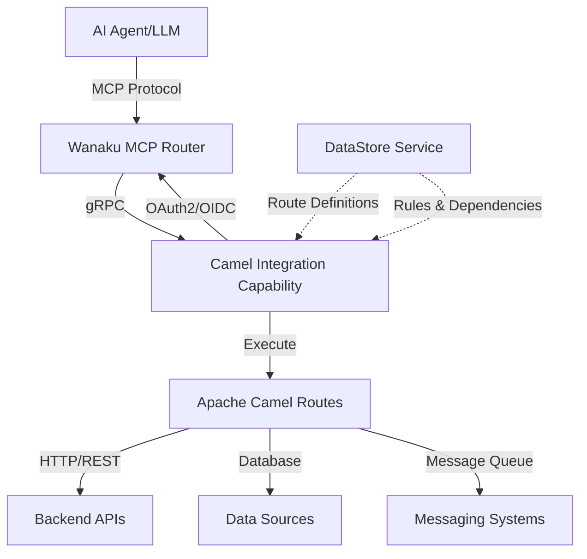

# Camel Integration Capability


A capability service for the [Wanaku MCP Router](https://wanaku.ai) that enables AI agents to interact with backend systems through dynamically executed [Apache Camel](https://camel.apache.org) routes.

## What is This?

The Camel Integration Capability bridges AI agents with enterprise integration patterns. 

It exposes Apache Camel routes as MCP (Model Context Protocol) tools and resources, allowing AI agents to perform complex backend operations through standardized gRPC interfaces.

**Key Use Cases:**
- Enable AI agents to query employee databases, CRMs, or inventory systems
- Orchestrate multi-step business workflows through natural language
- Integrate AI capabilities with existing enterprise service buses
- Provide controlled, rule-based access to backend APIs for AI agents

## Architecture Overview



The capability service:
1. Registers with the Wanaku MCP Router using OAuth2/OIDC
2. Loads Camel routes from YAML definitions (local files or DataStore)
3. Exposes routes as gRPC endpoints to the Wanaku MCP Router
4. Enforces access control rules defined in configuration
5. Executes routes dynamically with runtime dependency resolution

## Features

- **Dynamic Route Execution**: Load and execute Camel routes defined in YAML at runtime
- **MCP Integration**: Expose routes as tools and resources via Model Context Protocol using Wanaku MCP Router
- **Service Discovery**: Automatic registration with Wanaku MCP Router
- **Authentication**: OAuth2/OIDC support for service-to-router communication
- **Access Control**: Rule-based exposure of routes with configurable restrictions
- **Dependency Management**: Runtime download and loading of required Camel components
- **Multiple Deployment Options**: Run locally, in Docker, or on Kubernetes/OpenShift
- **Git Integration**: Initialize routes and configurations from Git repositories

## Quick Start

### Prerequisites

- Java 21 or higher
- Maven 3.6+ (for building from source)
- Access to a Wanaku MCP Router instance
- OAuth2/OIDC authentication provider (e.g., Keycloak)

### 5-Minute Setup

1. **Download the latest release** or build from source:
   ```bash
   git clone https://github.com/wanaku-ai/camel-integration-capability.git
   cd camel-integration-capability
   mvn clean package
   ```

2. **Prepare your Camel routes** (example `my-routes.camel.yaml`):
   ```yaml
   - route:
       id: get-employee-info
       from:
         uri: direct:get-employee-info
         steps:
           - to: https://api.example.com/employees/${header.employeeId}
   ```

3. **Prepare route exposure rules** (example `my-rules.yaml`):
   ```yaml
   mcp:
     tools:
        - get-employee-info:
            route:
             id: get-employee-info
            description: "Fetches core profile data for a specific employee"
   ```

4. **Run the capability**:
   ```bash
   java -jar target/camel-integration-capability-0.0.9-SNAPSHOT-jar-with-dependencies.jar \
     --registration-url http://localhost:8080 \
     --registration-announce-address localhost \
     --routes-ref file:///path/to/my-routes.camel.yaml \
     --rules-ref file:///path/to/my-rules.yaml \
     --token-endpoint http://localhost:8543/realms/wanaku/ \
     --client-id wanaku-service \
     --client-secret your-secret-here
   ```

5. **Verify registration**: Check Wanaku MCP Router logs to confirm successful registration.

> [!TIP]
> Design your Camel routes visually using the [Kaoto Integration Designer](http://kaoto.io) for Apache Camel.

> [!NOTE]
> For detailed configuration options and deployment scenarios, see the [Usage Guide](docs/usage.md).

## Documentation

- **[Usage Guide](docs/usage.md)** - Comprehensive guide to running and configuring the service
- **[Architecture](docs/architecture.md)** - System architecture and design decisions
- **[Building](docs/building.md)** - Build instructions and development setup
- **[Contributing](CONTRIBUTING.md)** - Guidelines for contributing to the project
- **[Security](SECURITY.md)** - Vulnerability reporting and security best practices

## Examples

See the included example files:
- `employee-backend.camel.yaml` - Sample Camel routes for employee data operations
- `employee-backend-rules.yaml` - Access control rules for route exposure

## Configuration

The service supports multiple URI schemes for loading resources:

| Scheme | Description | Example |
|--------|-------------|---------|
| `datastore://` | Fetch from Wanaku DataStore service | `datastore://routes.camel.yaml` |
| `file://` | Load from local filesystem (absolute path) | `file:///opt/routes/routes.camel.yaml` |

For complete parameter reference, see the [Usage Guide](docs/usage.md#required-parameters).

## Deployment

The recommended way to run this capability is on OpenShift/Kubernetes.

### Local Development

Local usage is recommended for development or debugging purposes.

```bash
java -jar target/camel-integration-capability-*.jar [options]
```

### Docker

The Docker/Container deployment can be used to customize the capability service.

```bash
docker build -t camel-capability .
docker run -p 9190:9190 camel-capability [options]
```

### Kubernetes/OpenShift

Deploy using the Wanaku operator. 

See [Usage Guide - Deploying the Service](docs/usage.md#deploying-the-service) for complete examples.

## Support

- **Issues**: [GitHub Issues](https://github.com/wanaku-ai/camel-integration-capability/issues)
- **Discussions**: [Wanaku Community](https://wanaku.ai)
- **Email**: contact@wanaku.ai

## License

This project is licensed under the Apache License 2.0 - see the [LICENSE](LICENSE) file for details.

## Related Projects

- [Wanaku MCP Router](https://wanaku.ai) - The MCP router this capability integrates with
- [Apache Camel](https://camel.apache.org) - The integration framework powering route execution
- [Kaoto Integration Designer](http://kaoto.io) - Visual designer for Camel routes
