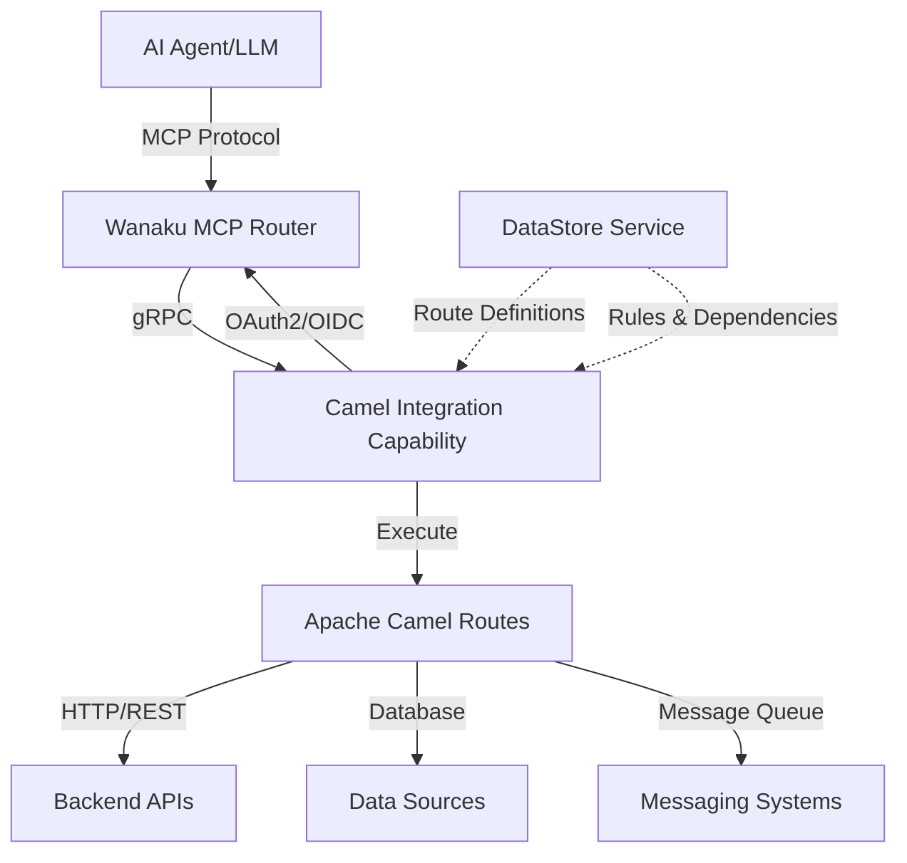

# Camel Integration Capability


A capability service for the [Wanaku MCP Router](https://wanaku.ai) that enables AI agents to interact with backend systems through dynamically executed [Apache Camel](https://camel.apache.org) routes.

## What is This?

The Camel Integration Capability bridges AI agents with enterprise integration patterns. 

It exposes Apache Camel routes as MCP (Model Context Protocol) tools and resources, allowing AI agents to perform complex backend operations through standardized gRPC interfaces.

**Key Use Cases:**
- Enable AI agents to query databases, CRMs, or inventory systems
- Orchestrate multi-step business workflows through natural language
- Integrate AI capabilities with existing enterprise service buses
- Provide controlled, rule-based access to backend APIs for AI agents

## Project Structure

```
camel-integration-capability/
├── camel-integration-capability-common/           # Shared utilities, models, gRPC services
└── camel-integration-capability-runtimes/
    ├── camel-integration-capability-plugin/       # SPI plugin for existing Camel apps
    └── camel-integration-capability-main/         # Standalone CLI application
```

## Deployment Options

| Option                             | Use Case                       | Configuration         |
|------------------------------------|--------------------------------|-----------------------|
| **[Standalone](docs/usage.md)**    | Dedicated service deployment   | CLI arguments         |
| **[Plugin](docs/plugin-usage.md)** | Embed into existing Camel apps | Environment variables |

## Architecture Overview




## Quick Start

### Prerequisites

- Java 21 or higher
- Maven 3.6+ (for building from source)
- Access to a Wanaku MCP Router instance
- OAuth2/OIDC authentication provider (e.g., Keycloak)

### 5-Minute Setup

1. **Download the latest release** or build from source:
   ```bash
   git clone https://github.com/wanaku-ai/camel-integration-capability.git
   cd camel-integration-capability
   mvn clean package
   ```

2. **Prepare your Camel routes** (example `my-routes.camel.yaml`):
   ```yaml
   - route:
       id: get-employee-info
       from:
         uri: direct:get-employee-info
         steps:
           - toD: https://api.example.com/employees/${header.Wanaku.employeeId}
   ```

3. **Prepare route exposure rules** (example `my-rules.yaml`):
   ```yaml
   mcp:
     tools:
        - get-employee-info:
            route:
             id: get-employee-info
            description: "Fetches core profile data for a specific employee"
   ```

   > [!NOTE]
   > This example uses automatic parameter mapping. 
   > All MCP parameters are mapped to Camel headers with the `Wanaku.` prefix (e.g., `employeeId` → `Wanaku.employeeId`). 
   > For explicit control over parameter names, see the [Usage Guide](docs/usage.md#parameter-to-header-mapping).

### Option 1: Standalone Application

Run as a dedicated service with CLI configuration:

```bash
java -jar camel-integration-capability-runtimes/camel-integration-capability-main/target/camel-integration-capability-main-*-jar-with-dependencies.jar \
  --registration-url http://localhost:8080 \
  --registration-announce-address localhost \
  --routes-ref file:///path/to/routes.camel.yaml \
  --rules-ref file:///path/to/rules.yaml \
  --client-id wanaku-service \
  --client-secret your-secret
```

### Option 2: Plugin Mode

Embed into an existing Camel application using SPI. Add the shaded jar to your classpath and configure via environment variables:

```bash
export REGISTRATION_URL=http://localhost:8080
export REGISTRATION_ANNOUNCE_ADDRESS=localhost
export GRPC_PORT=9190
export SERVICE_NAME=my-camel-app
export ROUTES_RULES=file:///path/to/rules.yaml
export CLIENT_ID=wanaku-service
export CLIENT_SECRET=your-secret

java -cp camel-integration-capability-plugin-*-shaded.jar:your-app.jar your.MainClass
```

The plugin is automatically discovered via `META-INF/services/org.apache.camel.spi.ContextServicePlugin`.

> [!TIP]
> Design your Camel routes visually using the [Kaoto Integration Designer](http://kaoto.io) for Apache Camel.

> [!NOTE]
> For detailed configuration options and deployment scenarios, see the [Usage Guide](docs/usage.md).

## Documentation

- **[Usage Guide](docs/usage.md)** - Standalone application configuration
- **[Plugin Guide](docs/plugin-usage.md)** - Embedding in Camel applications
- **[Building](docs/building.md)** - Build instructions and development setup
- **[Contributing](CONTRIBUTING.md)** - Guidelines for contributing
- **[Security](SECURITY.md)** - Vulnerability reporting

## Deployment

### Docker

```bash
mvn clean package -DskipTests
docker build -t camel-integration-capability .
docker run -p 9190:9190 camel-integration-capability [options]
```

### Kubernetes/OpenShift

Deploy using the Wanaku operator. See [Usage Guide](docs/usage.md#deploying-the-service) for examples.

## Support

- **Issues**: [GitHub Issues](https://github.com/wanaku-ai/camel-integration-capability/issues)
- **Community**: [Wanaku](https://wanaku.ai)
- **Email**: contact@wanaku.ai

## License

Apache License 2.0 - see [LICENSE](LICENSE) for details.

## Related Projects

- [Wanaku MCP Router](https://wanaku.ai) - The MCP router this capability integrates with
- [Apache Camel](https://camel.apache.org) - The integration framework powering route execution
- [Kaoto](http://kaoto.io) - Visual designer for Camel routes
