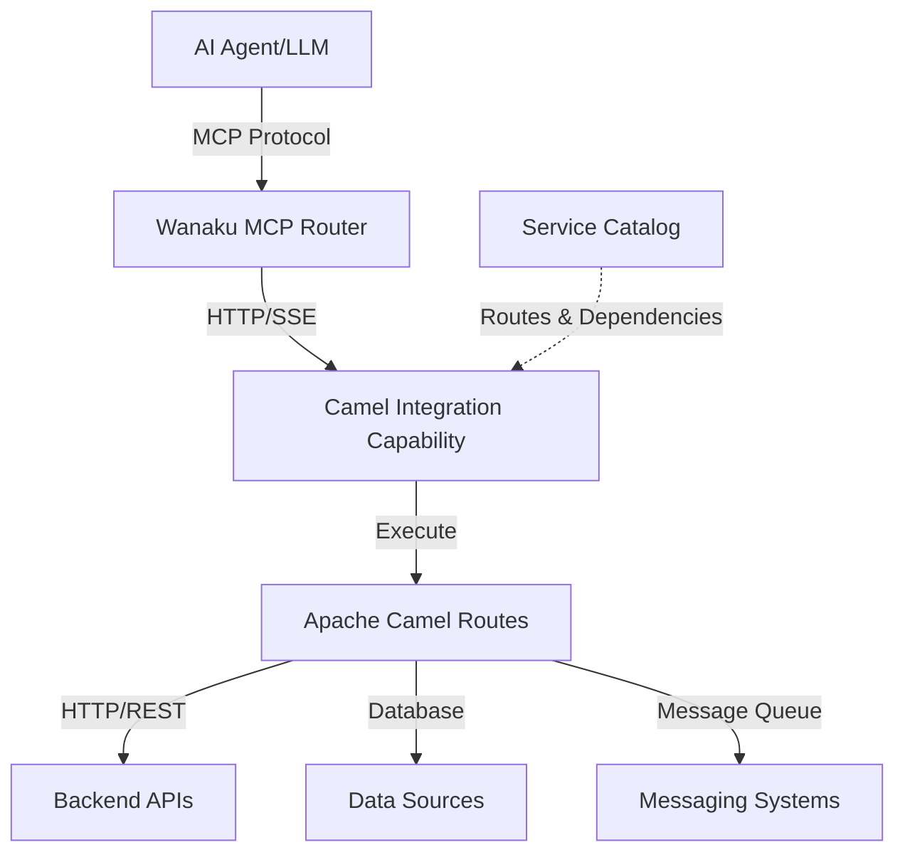

# Integration Capability for Apache Camel


A capability service for the [Wanaku MCP Router](https://wanaku.ai) that enables AI agents to interact with backend systems through dynamically executed [Apache Camel](https://camel.apache.org) routes.

## What is This?

The Integration Capability for Apache Camel bridges AI agents with enterprise integration patterns.

It downloads Apache Camel routes and runs them using Camel's built-in MCP server. Routes that use the `ai-tool:` URI format are automatically exposed as MCP tools via HTTP/SSE transport, allowing AI agents to perform complex backend operations.

**Key Use Cases:**

- Enable AI agents to query databases, CRMs, or inventory systems
- Orchestrate multi-step business workflows through natural language
- Integrate AI capabilities with existing enterprise service buses

## Project Structure

```text
camel-integration-capability/
└── camel-integration-capability-runtimes/
    └── camel-integration-capability-main/         # Standalone CLI application
```

## Architecture Overview


```mermaid
graph TB
    A[AI Agent/LLM] -->|MCP Protocol| B[Wanaku MCP Router]
    B -->|HTTP/SSE| C[Camel Integration Capability]
    C -->|Execute| E[Apache Camel Routes]
    E -->|HTTP/REST| F[Backend APIs]
    E -->|Database| G[Data Sources]
    E -->|Message Queue| H[Messaging Systems]

    I[Service Catalog] -.->|Routes & Dependencies| C
```

## Quick Start

### Prerequisites

- Java 21 or higher
- Maven 3.6+ (for building from source)
- Access to a Wanaku server instance

### 5-Minute Setup

1. **Download the latest release** or build from source:

   ```bash
   git clone https://github.com/wanaku-ai/camel-integration-capability.git
   cd camel-integration-capability
   mvn clean package
   ```

2. **Prepare your Camel routes** using the `ai-tool:` format (example `my-routes.camel.yaml`):

   ```yaml
   - route:
       id: get-employee-info
       from:
         uri: ai-tool:get-employee-info
         parameters:
           description: "Fetches core profile data for a specific employee"
         steps:
           - toD: https://api.example.com/employees/${header.employeeId}
   ```

3. **Run the capability**:

   The recommended approach is to use a **service catalog**, which bundles routes and dependencies into a single versioned artifact:

   ```bash
   java -jar camel-integration-capability-runtimes/camel-integration-capability-main/target/camel-integration-capability-main-*-jar-with-dependencies.jar \
     --registration-url http://localhost:8080 \
     --name employee-system \
     --service-catalog employee-system-v2 \
     --service-catalog-system employee-system
   ```

   You can also reference individual files instead of a catalog (useful during development):

   ```bash
   java -jar camel-integration-capability-runtimes/camel-integration-capability-main/target/camel-integration-capability-main-*-jar-with-dependencies.jar \
     --registration-url http://localhost:8080 \
     --routes-ref file:///path/to/routes.camel.yaml
   ```

> [!TIP]
> Design your Camel routes visually using the [Kaoto Integration Designer](http://kaoto.io) for Apache Camel.

<!-- -->

> [!NOTE]
> For detailed configuration options and deployment scenarios, see the [Usage Guide](docs/usage.md).

## Documentation

For stable release documentation, visit the **[Wanaku Documentation](https://wanaku.ai/docs/)** website.

The guides below cover development and unreleased features. They may describe behavior that differs from the latest stable release.

- **[Usage Guide](docs/usage.md)** - Configuration and deployment
- **[Service Catalog Guide](docs/service-catalog-guide.md)** - Creating and publishing service catalogs
- **[CLI Reference](docs/cli-reference.md)** - Complete command-line parameter reference
- **[Architecture](docs/architecture.md)** - System design and data flow
- **[Operations](docs/operations.md)** - Production deployment and monitoring
- **[Troubleshooting](docs/troubleshooting.md)** - Common issues and solutions
- **[Building](docs/building.md)** - Build instructions and development setup
- **[Migration Guide](docs/migration-guide.md)** - Upgrading between versions
- **[Examples](examples/)** - Working example routes and configurations
- **[Contributing](CONTRIBUTING.md)** - Guidelines for contributing
- **[Security](SECURITY.md)** - Vulnerability reporting

## Deployment

### Docker

```bash
mvn clean package -DskipTests
docker build -t camel-integration-capability .
docker run -p 8080:8080 camel-integration-capability [options]
```

### Kubernetes/OpenShift

Deploy using the Wanaku operator. See [Usage Guide](docs/usage.md#deploying-the-service) for examples.

## Support

- **Issues**: [GitHub Issues](https://github.com/wanaku-ai/camel-integration-capability/issues)
- **Community**: [Wanaku](https://wanaku.ai)
- **Email**: <contact@wanaku.ai>

## License

Apache License 2.0 - see [LICENSE](LICENSE) for details.

## Related Projects

- [Wanaku MCP Router](https://wanaku.ai) - The MCP router this capability integrates with
- [Apache Camel](https://camel.apache.org) - The integration framework powering route execution
- [Kaoto](http://kaoto.io) - Visual designer for Camel routes
