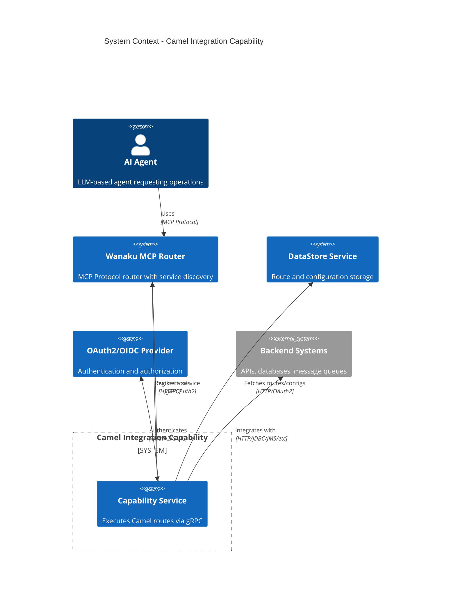
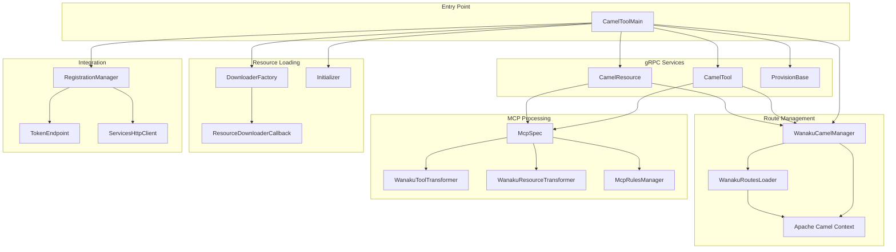
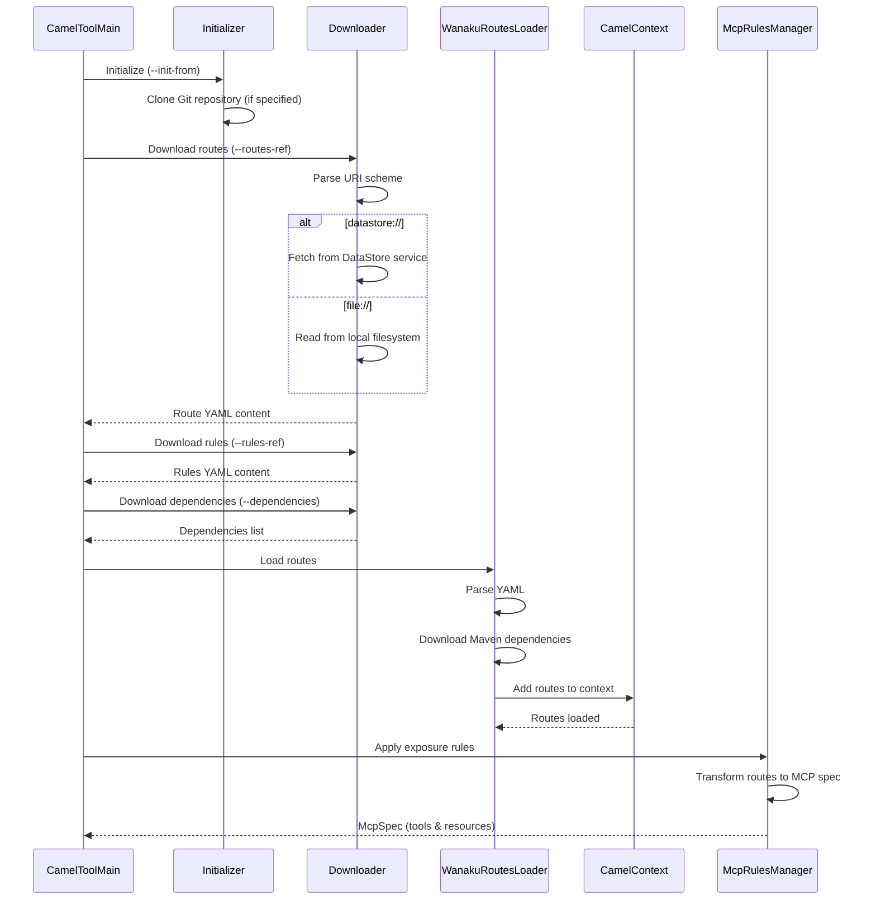
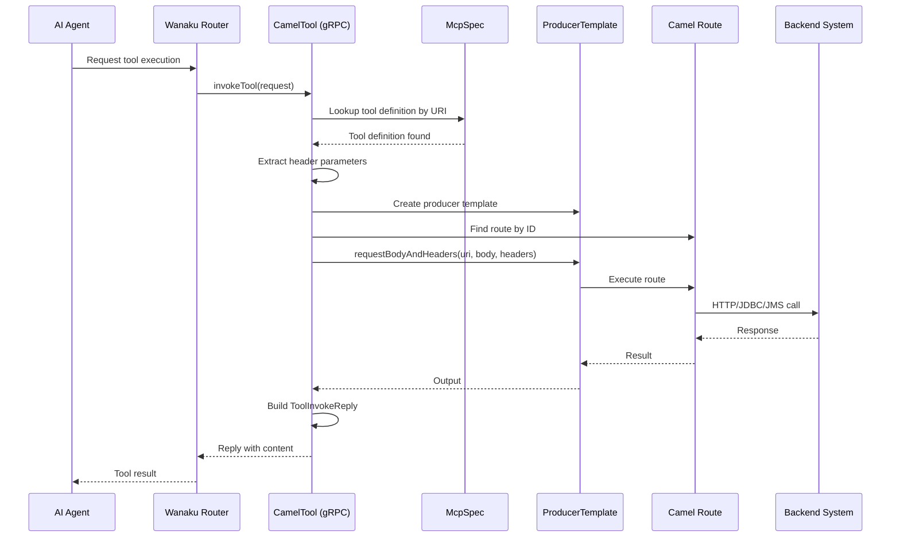
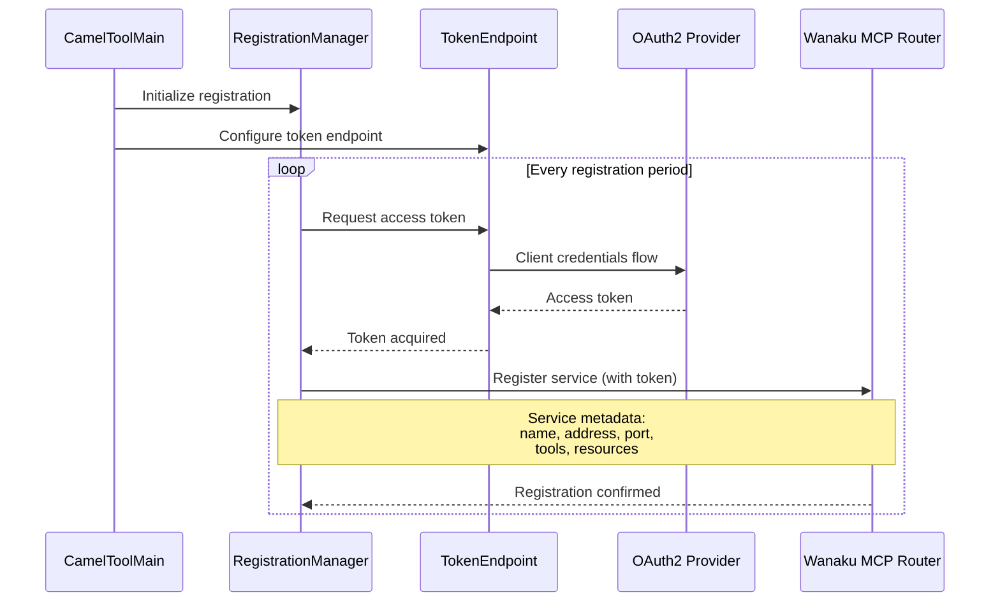
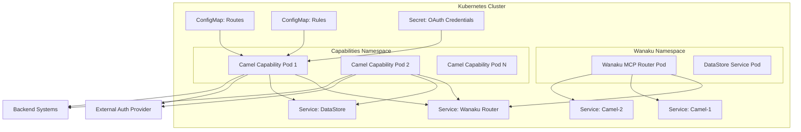
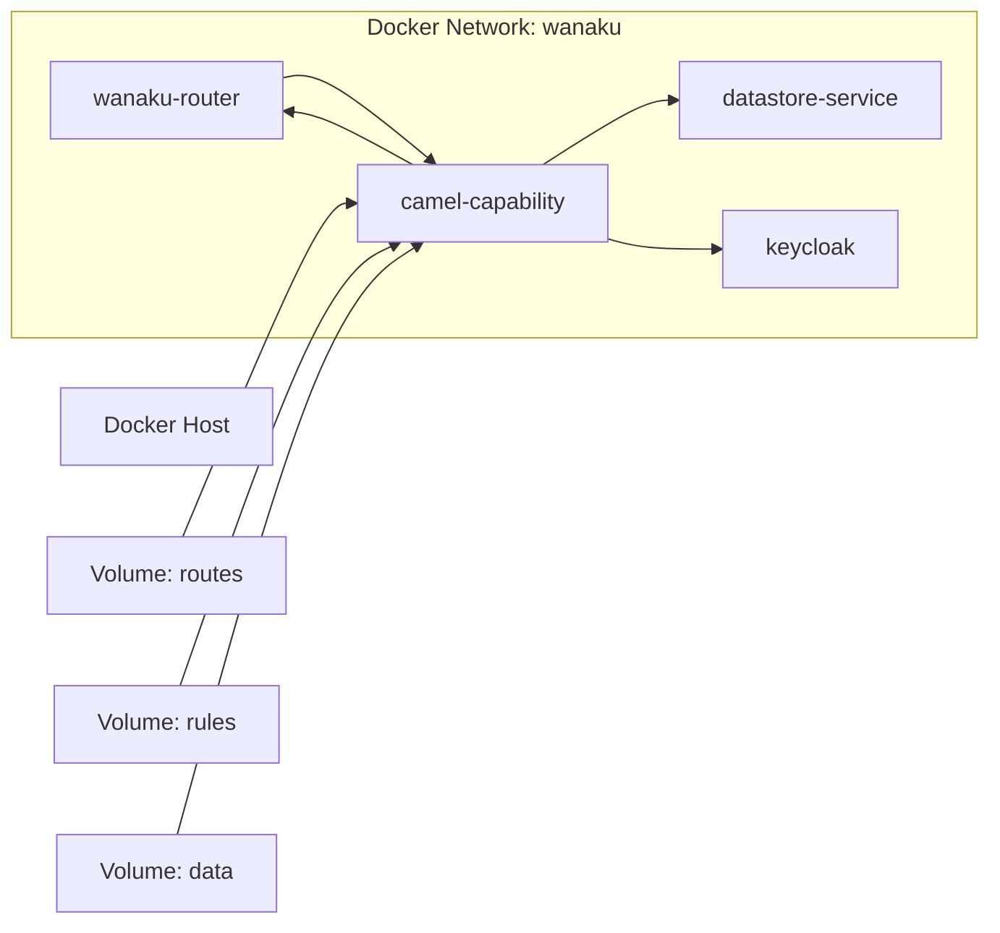
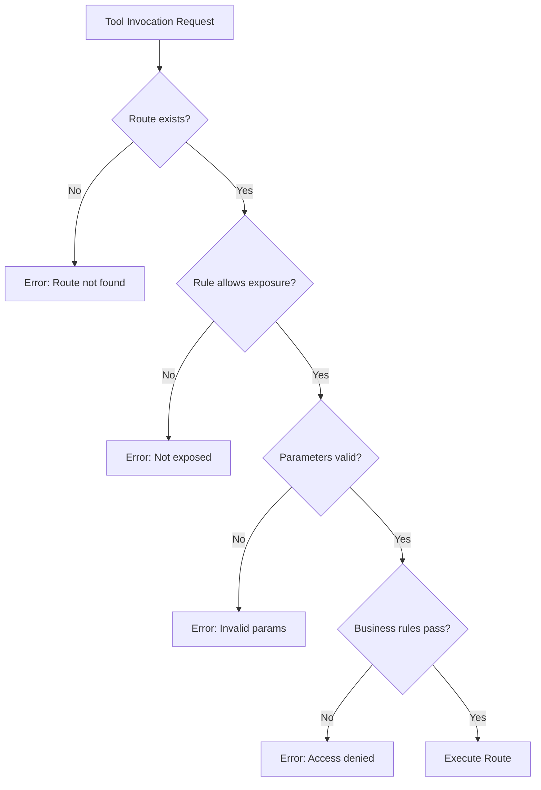

# Architecture

This document describes the architecture and design decisions for the Camel Integration Capability.

## System Overview

The Camel Integration Capability acts as a bridge between AI agents and enterprise integration systems. 

It dynamically loads Apache Camel routes and exposes them as MCP (Model Context Protocol) tools and resources through Wanaku's gRPC bridge, 
enabling AI agents to interact with backend systems in a controlled, secure manner.

### High-Level Architecture

## Component Architecture

### Core Components

### Component Responsibilities

| Component | Package | Responsibility |
|-----------|---------|----------------|
| **CamelToolMain** | `ai.wanaku.capability.camel` | Application entry point, CLI parameter parsing, service initialization |
| **CamelTool** | `ai.wanaku.capability.camel.grpc` | gRPC service for tool invocation, route execution |
| **CamelResource** | `ai.wanaku.capability.camel.grpc` | gRPC service for resource retrieval |
| **ProvisionBase** | `ai.wanaku.capability.camel.grpc` | gRPC service providing capability metadata |
| **WanakuCamelManager** | `ai.wanaku.capability.camel` | Manages Camel context lifecycle |
| **WanakuRoutesLoader** | `ai.wanaku.capability.camel.util` | Loads routes from YAML, handles dependencies |
| **McpSpec** | `ai.wanaku.capability.camel.model` | MCP specification model (tools and resources) |
| **WanakuToolTransformer** | `ai.wanaku.capability.camel.spec.rules.tools` | Transforms Camel routes into MCP tool definitions |
| **WanakuResourceTransformer** | `ai.wanaku.capability.camel.spec.rules.resources` | Transforms Camel routes into MCP resource definitions |
| **McpRulesManager** | `ai.wanaku.capability.camel.util` | Applies exposure rules to routes |
| **DownloaderFactory** | `ai.wanaku.capability.camel.downloader` | Creates appropriate downloaders for URI schemes |
| **RegistrationManager** | `ai.wanaku.capabilities.sdk.api.discovery` | Handles service registration with Wanaku MCP Router |

## Data Flow

### Route Loading and Initialization

### Tool Invocation Flow

### Service Registration Flow

## Design Decisions

### 1. Dynamic Route Loading

**Decision**: Load Camel routes dynamically from YAML at runtime instead of compile-time route builders.

**Rationale**:
- Allows non-developers to create integrations
- Routes can be updated without recompiling/redeploying
- Supports external route storage (DataStore, Git)
- Enables visual route design tools (Kaoto)

**Trade-offs**:
- Runtime errors instead of compile-time validation
- Slightly slower startup time
- Requires careful YAML schema validation

### 2. gRPC for Tool Invocation

**Decision**: Use gRPC instead of REST for communication with Wanaku router.

**Rationale**:
- Efficient binary protocol reduces latency
- Built-in streaming support for future enhancements
- Strong typing via Protocol Buffers
- Better performance for high-frequency invocations
- Standard in Wanaku ecosystem

### 3. OAuth2/OIDC Authentication

**Decision**: Use OAuth2 client credentials flow for service-to-service authentication.

**Rationale**:
- Industry-standard authentication mechanism
- Centralized token management
- Support for token refresh
- Compatible with enterprise identity providers (Keycloak, Okta, etc.)

### 4. Multiple URI Schemes

**Decision**: Support both `datastore://` and `file://` schemes for resource loading.

**Rationale**:
- `datastore://` enables centralized configuration management
- `file://` supports local development and air-gapped deployments
- Extensible design allows future schemes (e.g., `git://`, `http://`)

### 5. Rule-Based Route Exposure

**Decision**: Implement explicit rules for exposing routes as MCP tools/resources.

**Rationale**:
- Security: Not all routes should be exposed to AI agents
- Flexibility: Same route can be exposed as tool or resource
- Access control: Restrict certain operations or data
- Documentation: Rules serve as API contract

### 6. Runtime Dependency Resolution

**Decision**: Download Maven dependencies at runtime instead of bundling everything.

**Rationale**:
- Smaller container images (base image + minimal JARs)
- Flexibility to use different Camel components per deployment
- Reduces build time and artifact size
- Supports dynamic component loading

**Trade-offs**:
- Slower first startup (dependency download)
- Requires network access at startup
- Potential version conflicts if not carefully managed

### 7. Flexible Parameter Mapping

**Decision**: Support both automatic and explicit parameter-to-header mapping strategies.

**Rationale**:
- **Automatic mapping** (default): All MCP parameters automatically map to Camel headers with `Wanaku.` prefix
  - Simplifies development and prototyping
  - No configuration needed for basic use cases
  - All parameters are available to routes
- **Explicit mapping**: Properties with defined mappings control exactly what gets passed
  - Production-grade control over parameter names
  - Validation and documentation through schema
  - Security through parameter filtering

**Implementation**:
The `HeaderMapperFactory` selects the appropriate mapper:
- `NoopHeaderMapper`: When tool definition is null (no headers)
- `AutoMapper`: When properties are not defined (all parameters with `Wanaku.` prefix)
- `FilteredMapper`: When properties with mappings are defined (explicit control)

**Trade-offs**:
- Automatic mapping is convenient but requires `Wanaku.` prefix in routes
- Explicit mapping is more verbose but provides better control and documentation
- Users must choose one strategy per tool (mixing is not supported)

## Integration Points

### Wanaku Ecosystem Integration

The capability integrates with several Wanaku services:

| Service | Purpose | Protocol | Authentication |
|---------|---------|----------|----------------|
| **Wanaku MCP Router** | Service registration, health checks, and tool invocation requests | HTTP/gRPC | OAuth2 token |
| **DataStore Service** | Fetch routes, rules, dependencies | HTTP | OAuth2 token |
| **OAuth2 Provider** | Obtain access tokens | HTTP | Client credentials |

### External System Integration

Camel routes can integrate with any system supported by Apache Camel components:

- **HTTP/REST APIs**: Using `camel-http` or `camel-rest`
- **Databases**: Using `camel-jdbc`, `camel-jpa`, `camel-sql`
- **Message Queues**: Using `camel-kafka`, `camel-jms`, `camel-amqp`
- **File Systems**: Using `camel-file`, `camel-ftp`
- **Cloud Services**: AWS, Azure, GCP connectors
- **Other Protocols**: SMTP, LDAP, SSH, etc.

## Deployment Architecture

### Kubernetes/OpenShift Deployment

### Docker Deployment

## Security Considerations

### Authentication Flow

1. **Service Startup**: Capability obtains OAuth2 access token using client credentials
2. **Registration**: Token included in registration request to Wanaku MCP Router
3. **Tool Invocation**: Wanaku MCP Router validates token before forwarding requests
4. **Token Refresh**: Automatic token refresh before expiration

### Access Control

Access control is enforced at multiple levels:

1. **Route-level**: Rules determine which routes are exposed
2. **Parameter-level**: Schema validation of input parameters
3. **Business-level**: Custom logic within Camel routes (e.g., checking user permissions)
4. **Network-level**: Kubernetes NetworkPolicies restrict pod communication

### Secrets Management

Sensitive data should never be embedded in route definitions:

- **OAuth credentials**: Passed as CLI arguments or environment variables
- **API keys**: Stored in Kubernetes Secrets, injected as env vars
- **Database passwords**: Retrieved from secret management systems (Vault, AWS Secrets Manager)
- **Client secrets**: Never logged or exposed in error messages

## Performance Characteristics

### Startup Time

- **Cold start** (with dependency download): 30-60 seconds
- **Warm start** (dependencies cached): 10-20 seconds

### Runtime Performance

- **Route execution**: Sub-millisecond overhead (Camel ProducerTemplate)
- **gRPC overhead**: 1-5ms per invocation
- **Authentication overhead**: Token cached, minimal per-request overhead

### Scalability

The capability is **stateless** and can be horizontally scaled:

- Multiple instances can run concurrently
- Each instance registers independently with Wanaku MCP Router
- No shared state between instances
- Load balancing handled by Wanaku MCP Router

### Resource Requirements

Typical resource allocation:

| Resource | Minimum | Recommended | Notes |
|----------|---------|-------------|-------|
| CPU | 0.5 cores | 1-2 cores | Depends on route complexity |
| Memory | 512 MB | 1-2 GB | Camel context + routes + dependencies |
| Disk | 100 MB | 1 GB | Dependency cache |
| Network | - | Low latency to backend systems | Critical for route performance |

## Extensibility

### Adding New URI Schemes

To support additional resource loading schemes:

1. Implement `ResourceDownloader` interface
2. Register in `DownloaderFactory`
3. Update documentation

Example: Adding `git://` scheme for direct Git repository access.

### Custom Rule Processors

To implement custom exposure rules:

1. Extend `WanakuToolRuleProcessor` or `WanakuResourceRuleProcessor`
2. Implement custom filtering logic
3. Register in `McpRulesManager`

### Custom Initializers

To add initialization logic (e.g., database schema setup):

1. Implement `Initializer` interface
2. Register in `InitializerFactory`
3. Specify via `--init-from` parameter

## Observability

### Logging

The capability uses SLF4J with Log4j2 backend:

- **Level**: Configurable via `log4j2.xml`
- **Key loggers**:
  - `ai.wanaku.capability.camel.CamelToolMain` - Application lifecycle
  - `ai.wanaku.capability.camel.grpc.CamelTool` - Tool invocations
  - `ai.wanaku.capability.camel.util.WanakuRoutesLoader` - Route loading
  - `org.apache.camel` - Camel framework events

### Metrics

Currently not implemented. Future considerations:

- Prometheus metrics export
- Route execution times
- Error rates per route
- gRPC request/response times

### Tracing

Currently not implemented. Future considerations:

- OpenTelemetry integration
- Distributed tracing across Wanaku services
- Camel route step tracing

## Future Enhancements

Potential areas for improvement:

1. **Route Hot Reload**: Detect and reload route changes without restart
2. **Rate Limiting**: Protect backend systems from excessive requests
3. **Caching**: Cache route execution results for idempotent operations
4. **Batch Operations**: Support batch invocations for efficiency
5. **Multi-tenancy**: Isolate routes per tenant/organization
6. **Async Execution**: Non-blocking route execution with callbacks
7. **Schema Validation**: Stronger input/output schema validation
8. **Metrics & Monitoring**: Prometheus, Grafana dashboards

