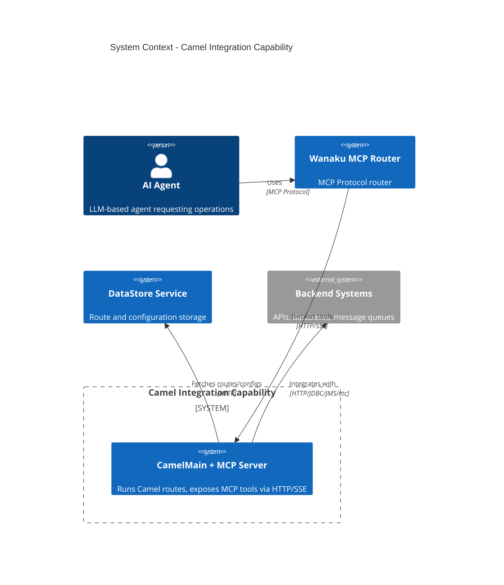
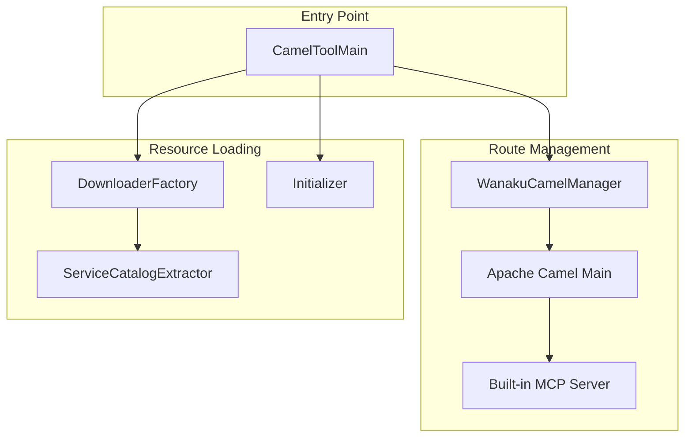
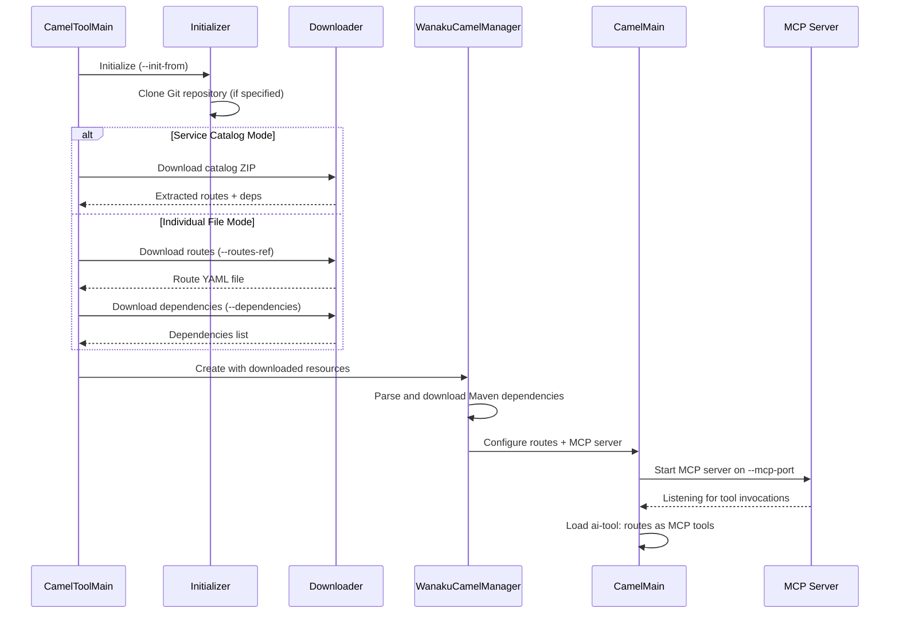
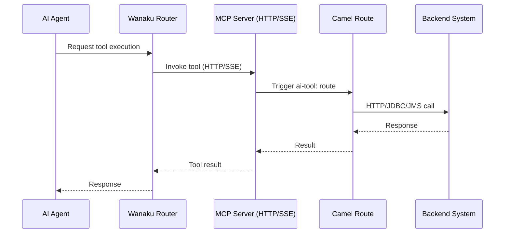
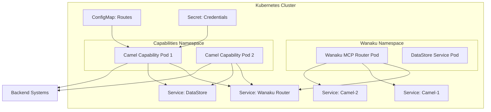

# Architecture

This document describes the architecture and design decisions for the Camel Integration Capability.

## System Overview

The Camel Integration Capability (CIC) downloads Apache Camel routes from Wanaku's DataStore (or a local/remote source) and runs them using Apache Camel's Main runtime with its built-in MCP server. Routes that use the `ai-tool:` URI format are automatically exposed as MCP tools via HTTP/SSE transport.

### High-Level Architecture

```mermaid
C4Context
    title System Context - Camel Integration Capability

    Person(agent, "AI Agent", "LLM-based agent requesting operations")
    System(wanaku, "Wanaku MCP Router", "MCP Protocol router")
    System_Boundary(capability, "Camel Integration Capability") {
        System(camel, "CamelMain + MCP Server", "Runs Camel routes, exposes MCP tools via HTTP/SSE")
    }
    System(datastore, "DataStore Service", "Route and configuration storage")
    System_Ext(backend, "Backend Systems", "APIs, databases, message queues")

    Rel(agent, wanaku, "Uses", "MCP Protocol")
    Rel(wanaku, camel, "Invokes tools", "HTTP/SSE")
    Rel(camel, datastore, "Fetches routes/configs", "HTTP")
    Rel(camel, backend, "Integrates with", "HTTP/JDBC/JMS/etc")
```

## Component Architecture

### Core Components

```mermaid
graph TB
    subgraph "Entry Point"
        A[CamelToolMain]
    end

    subgraph "Route Management"
        E[WanakuCamelManager]
        F[Apache Camel Main]
        G[Built-in MCP Server]
    end

    subgraph "Resource Loading"
        L[DownloaderFactory]
        M[ServiceCatalogExtractor]
        N[Initializer]
    end

    A --> E
    A --> L
    A --> N

    E --> F
    F --> G

    L --> M
```

### Component Responsibilities

| Component | Responsibility |
|-----------|----------------|
| **CamelToolMain** | CLI parameter parsing, resource downloading, service initialization |
| **WanakuCamelManager** | Configures and runs Apache Camel Main with MCP server enabled |
| **DownloaderFactory** | Creates appropriate downloaders for URI schemes (`datastore://`, `file://`) |
| **ServiceCatalogExtractor** | Extracts routes and dependencies from a service catalog ZIP |
| **Initializer** | Handles Git clone initialization (`--init-from`) |

## Data Flow

### Startup and Route Loading

```mermaid
sequenceDiagram
    participant Main as CamelToolMain
    participant Init as Initializer
    participant Down as Downloader
    participant Manager as WanakuCamelManager
    participant Camel as CamelMain
    participant MCP as MCP Server

    Main->>Init: Initialize (--init-from)
    Init->>Init: Clone Git repository (if specified)

    alt Service Catalog Mode
        Main->>Down: Download catalog ZIP
        Down-->>Main: Extracted routes + deps
    else Individual File Mode
        Main->>Down: Download routes (--routes-ref)
        Down-->>Main: Route YAML file
        Main->>Down: Download dependencies (--dependencies)
        Down-->>Main: Dependencies list
    end

    Main->>Manager: Create with downloaded resources
    Manager->>Manager: Parse and download Maven dependencies
    Manager->>Camel: Configure routes + MCP server
    Camel->>MCP: Start MCP server on --mcp-port
    MCP-->>Camel: Listening for tool invocations
    Camel->>Camel: Load ai-tool: routes as MCP tools
```

### Tool Invocation Flow

```mermaid
sequenceDiagram
    participant Agent as AI Agent
    participant Router as Wanaku Router
    participant MCP as MCP Server (HTTP/SSE)
    participant Camel as Camel Route
    participant Backend as Backend System

    Agent->>Router: Request tool execution
    Router->>MCP: Invoke tool (HTTP/SSE)
    MCP->>Camel: Trigger ai-tool: route
    Camel->>Backend: HTTP/JDBC/JMS call
    Backend-->>Camel: Response
    Camel-->>MCP: Result
    MCP-->>Router: Tool result
    Router-->>Agent: Response
```

## Design Decisions

### 1. Camel Built-in MCP Server

**Decision**: Use Apache Camel 4.22's built-in MCP server instead of a custom gRPC bridge.

**Rationale**:

- Eliminates the custom gRPC service layer
- MCP tool definitions are embedded directly in route files (`ai-tool:` URI format)
- HTTP/SSE transport is simpler to debug and deploy than gRPC
- Reduces the codebase and maintenance surface

### 2. ai-tool: Route Format

**Decision**: Use Camel's `ai-tool:` URI format instead of separate rules YAML files.

**Rationale**:

- Tool metadata (description, parameters) lives alongside the route logic
- Single file to maintain instead of routes + rules
- Native Camel integration with no custom transformation layer
- Tag-based filtering via `--mcp-tags` provides flexible tool selection

### 3. Dynamic Route Loading

**Decision**: Load Camel routes dynamically from YAML at runtime instead of compile-time route builders.

**Rationale**:

- Allows non-developers to create integrations
- Routes can be updated without recompiling/redeploying
- Supports external route storage (DataStore, Git)
- Enables visual route design tools (Kaoto)

### 4. Multiple URI Schemes

**Decision**: Support both `datastore://` and `file://` schemes for resource loading.

**Rationale**:

- `datastore://` enables centralized configuration management
- `file://` supports local development and air-gapped deployments

### 5. Runtime Dependency Resolution

**Decision**: Download Maven dependencies at runtime instead of bundling everything.

**Rationale**:

- Smaller container images
- Flexibility to use different Camel components per deployment
- Supports dynamic component loading

**Trade-offs**:

- Slower first startup (dependency download)
- Requires network access at startup

## Deployment Architecture

### Kubernetes/OpenShift Deployment

```mermaid
graph TB
    subgraph "Kubernetes Cluster"
        subgraph "Wanaku Namespace"
            A[Wanaku MCP Router Pod]
            C[DataStore Service Pod]
        end

        subgraph "Capabilities Namespace"
            D[Camel Capability Pod 1]
            E[Camel Capability Pod 2]
        end

        G[Service: Wanaku Router]
        H[Service: DataStore]
        I[Service: Camel-1]
        J[Service: Camel-2]

        K[ConfigMap: Routes]
        M[Secret: Credentials]
    end

    O[Backend Systems]

    A --> G
    A --> I
    A --> J

    D --> G
    D --> H
    E --> G
    E --> H

    K --> D
    M --> D

    D --> O
    E --> O
```

## Performance Characteristics

### Startup Time

- **Cold start** (with dependency download): 30-60 seconds
- **Warm start** (dependencies cached): 10-20 seconds

### Runtime Performance

- **Route execution**: Sub-millisecond overhead (Camel ProducerTemplate)
- **MCP overhead**: 1-5ms per invocation (HTTP/SSE)

### Scalability

The capability is **stateless** and can be horizontally scaled:

- Multiple instances can run concurrently
- No shared state between instances
- Load balancing handled by Kubernetes Services or Wanaku MCP Router

### Resource Requirements

| Resource | Minimum | Recommended | Notes |
|----------|---------|-------------|-------|
| CPU | 0.5 cores | 1-2 cores | Depends on route complexity |
| Memory | 512 MB | 1-2 GB | Camel context + routes + dependencies |
| Disk | 100 MB | 1 GB | Dependency cache |

## Observability

### Logging

The capability uses SLF4J with Log4j2 backend:

- `ai.wanaku.capability.camel.CamelToolMain` - Application lifecycle
- `ai.wanaku.capability.camel.WanakuCamelManager` - Route loading, MCP server configuration
- `org.apache.camel` - Camel framework events

### Future Enhancements

- Prometheus metrics export
- OpenTelemetry integration
- Route hot reload
