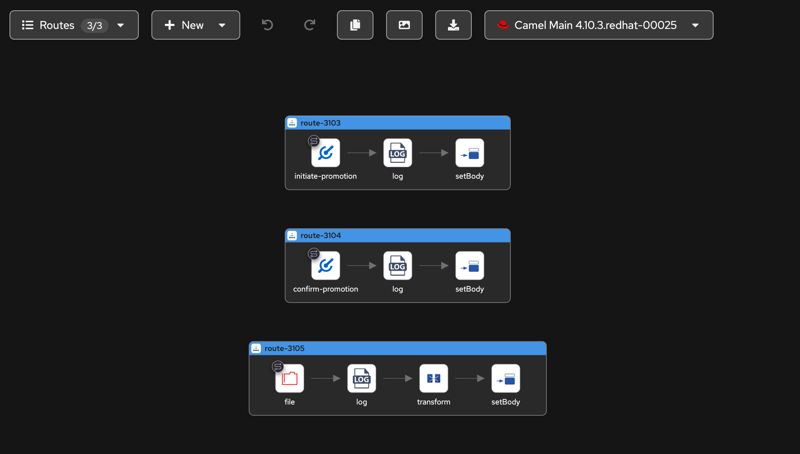

# Camel Core Downstream Service

A capability service for the [Wanaku MCP Router](https://wanaku.ai) that provides [Apache Camel](https://camel.apache.org) route
execution capabilities.

This service integrates with the Wanaku ecosystem to execute Camel routes dynamically through Wanaku's gRPC bridge. 

## Overview

This service implements a Wanaku capability that can:
- Execute Apache Camel routes defined in YAML format
- Register itself with a Wanaku discovery service
- Support service-to-router authentication via OAuth2/OIDC

> [TIP]
> Design your Camel routes with ease using the [Kaoto Integration Designer](http://kaoto.io) for Apache Camel.

## Requirements

- Java 21 or higher
- Maven 3.6+ for building
- Access to a Wanaku discovery service
- OAuth2/OIDC authentication provider

## Running this Capability

This capability service requires configuration parameters to connect to the Wanaku ecosystem. When launching it, you need to 
set them so that this capability service can talk to Wanaku and register itself. 

> [NOTE]
> Although this capability is intended to be run inside Kubernetes or OpenShift, it is entirely possible to execute it locally.

### Required Parameters

- `--registration-url`: URL of the Wanaku discovery service
- `--registration-announce-address`: Address to announce for service discovery
- `--routes-path`: Path to the Apache Camel routes YAML file (e.g., `/path/to/routes.camel.yaml`)
- `--token-endpoint`: OAuth2/OIDC token endpoint base URL
- `--client-id`: OAuth2 client ID for authentication
- `--client-secret`: OAuth2 client secret for authentication
- `--routes-rules`: Path to the YAML file with route exposure rules (e.g., `/path/to/routes-expose.yaml`)
- `--dependencies`: A comma-separated list of dependencies to include on the classpath (they are automatically downloaded and added to the classpath)

### Optional Parameters

- `--grpc-port`: gRPC server port (default: 9190)
- `--name`: Service name for registration (default: "camel")
- `--retries`: Maximum registration retries (default: 3)
- `--wait-seconds`: Wait time between retries (default: 1)
- `--initial-delay`: Initial registration delay in seconds (default: 0)
- `--period`: Period between registration attempts in seconds (default: 5)
- `--data-dir`: Directory where downloaded files will be saved (default: `/tmp` for CLI, `/data` for Docker)

### Basic Example (Local)

For local development with a Wanaku stack:

```bash
java -jar target/camel-integration-capability-1.0-SNAPSHOT.jar \
  --registration-url http://localhost:8080 \
  --registration-announce-address localhost \
  --grpc-port 9190 \
  --name camel-core \
  --routes-ref datastore://promote-employee.camel.yaml \
  --rules-ref datastore://promote-employee-rules.yaml \
  --token-endpoint http://localhost:8543/realms/wanaku/ \
  --client-id wanaku-service \
  --client-secret aBqsU3EzUPCHumf9sTK5sanxXkB0yFtv \
  --dependencies datastore://promote-employee-dependencies.txt \
  --data-dir /tmp/camel-data
```

Where `promote-employee-dependencies.txt` is a text file containing the dependencies in a comma-separated list:

```shell
org.apache.camel:camel-http:4.14.2,org.apache.camel:camel-jackson:4.14.2
```

## Deploying the Service

The service can be deployed to Kubernetes or OpenShift using Kustomize. One requirement is that
the deployment needs a way to get the route files in the storage used by the container. There is 
multiple ways to do this (such as using an init container of copying the files using `kubectl cp`. 

In the provided deployment, it uses an init container that clones your Camel routes repository.

### Init Container Sample

Wanaku does not provide the init-container, but you can create one with a Dockerfile similar to this:

```dockerfile
FROM registry.access.redhat.com/ubi9/ubi-minimal:latest
VOLUME /data
WORKDIR /data
RUN microdnf install -y git

ENV GIT_REPO_URL="" \
    GIT_BRANCH=${GIT_BRANCH:-main}

CMD ["/bin/bash", "-c", "git clone -b $GIT_BRANCH $GIT_REPO_URL"]
```

Build and publish it to the registry of your choice.


### Configuration

Before deploying, you need to configure the service by editing the overlay kustomization file for your environment.

Edit `deploy/openshift/kustomize/overlays/dev/kustomization.yaml`:

```yaml
configMapGenerator:
- name: camel-integration-capability-config
  behavior: merge
  literals:
  - git-repo-url=http://github.com/your-org/your-routes-repo
  - grpc-port=9190
  - registration-url=http://wanaku-router-backend:8080
  - registration-announce-address=auto
  - service-name=camel-integration-capability-dev
  - routes-path=/data/your-routes-repo/routes/your-route.camel.yaml
  - routes-rules=/data/your-routes-repo/routes/your-route-rules.yaml

secretGenerator:
- name: camel-integration-capability-secrets
  behavior: merge
  literals:
  - client-id=wanaku-service
  - client-secret=your-oauth-secret-here
  - token-endpoint=http://keycloak:8080/realms/wanaku/
```

#### Required Configuration

| Parameter | Description | Example |
|-----------|-------------|---------|
| `git-repo-url` | Git repository containing your Camel routes | `http://github.com/myorg/routes` |
| `routes-path` | Path to the Camel routes YAML file | `/data/myrepo/route.camel.yaml` |
| `routes-rules` | Path to the route exposure rules YAML | `/data/myrepo/route-rules.yaml` |
| `registration-url` | Wanaku discovery service URL | `http://wanaku-router-backend:8080` |
| `client-secret` | OAuth2 client secret | (secret value) |
| `token-endpoint` | OAuth2/OIDC token endpoint | `http://keycloak:8080/realms/wanaku/` |

#### Optional Configuration

| Parameter | Description | Default           |
|-----------|-------------|-------------------|
| `grpc-port` | gRPC server port | `9190`            |
| `service-name` | Service name for registration | `my-service-name` |
| `registration-announce-address` | Service announcement address | `auto`            |
| `client-id` | OAuth2 client ID | `wanaku-service`  |
| `data-dir` | Directory where downloaded files are saved | `/data`           |


### Deploying to the Cluster

Deploy to development environment:

```bash
# Preview what will be deployed
kubectl kustomize deploy/openshift/kustomize/overlays/dev

# Apply the deployment
kubectl apply -k deploy/openshift/kustomize/overlays/dev
```

### Deployment Features

#### Init Container

The deployment includes an init container that:
- Uses UBI9 minimal image with git
- Clones the repository specified in `git-repo-url`
- Stores the cloned repository in `/data` directory (shared with main container)
- Allows you to deploy routes without rebuilding the container image

#### Resource Limits

Default resource allocation (configurable in `base/deployment.yaml`):

- **Requests**: 512Mi memory, 250m CPU
- **Limits**: 1Gi memory, 1000m CPU

Adjust these based on your workload:

```yaml
resources:
  requests:
    memory: "1Gi"
    cpu: "500m"
  limits:
    memory: "2Gi"
    cpu: "2000m"
```

#### Health Checks

The deployment includes:
- **Liveness probe**: TCP check on gRPC port (9190)
  - Initial delay: 30 seconds
  - Period: 10 seconds
- **Readiness probe**: TCP check on gRPC port (9190)
  - Initial delay: 10 seconds
  - Period: 5 seconds

### Verifying the Deployment

Check deployment status:

```bash
# Check pods
kubectl get pods -l app=camel-integration-capability

# Check init container logs
kubectl logs -f deployment/camel-integration-capability -c git-clone

# Check main container logs
kubectl logs -f deployment/camel-integration-capability -c camel-integration-capability

# Verify routes were cloned
kubectl exec deployment/camel-integration-capability -- ls -la /data

# Check service
kubectl get svc camel-integration-capability
```

### Using Secrets Securely

For production environments, create secrets separately instead of embedding them in kustomization files:

```bash
# Create secret from literals
kubectl create secret generic camel-integration-capability-secrets \
  --from-literal=client-secret=YOUR_SECRET_HERE \
  --from-literal=token-endpoint=https://keycloak.example.com/realms/wanaku/ \
  --from-literal=client-id=wanaku-service

# Or from files
kubectl create secret generic camel-integration-capability-secrets \
  --from-file=client-secret=./secret.txt \
  --from-file=token-endpoint=./endpoint.txt
```

Then remove the secretGenerator from your kustomization.yaml overlay.

### Troubleshooting

Common issues and solutions:

**Routes not found:**
```bash
# Verify git clone succeeded
kubectl exec deployment/camel-integration-capability -- ls -la /data

# Check init container logs
kubectl logs deployment/camel-integration-capability -c git-clone
```

**Service not registering:**
```bash
# Check environment variables
kubectl exec deployment/camel-integration-capability -- env | grep -E "(REGISTRATION|TOKEN)"

# View application logs
kubectl logs -f deployment/camel-integration-capability -c camel-integration-capability
```

**Connection refused errors:**
```bash
# Verify service is running
kubectl get svc camel-integration-capability

# Check pod status
kubectl describe pod -l app=camel-integration-capability

# Test connectivity
kubectl run test-pod --rm -it --image=busybox -- telnet camel-integration-capability 9190
```

### Multi-Environment Deployments

For production, create a new overlay:

```bash
mkdir -p deploy/openshift/kustomize/overlays/prod
```

Create `deploy/openshift/kustomize/overlays/prod/kustomization.yaml`:

```yaml
apiVersion: kustomize.config.k8s.io/v1beta1
kind: Kustomization

resources:
- ../../base

configMapGenerator:
- name: camel-integration-capability-config
  behavior: merge
  literals:
  - git-repo-url=http://github.com/your-org/prod-routes
  - grpc-port=9190
  - registration-url=http://wanaku-router-backend.prod:8080
  - registration-announce-address=auto
  - service-name=camel-integration-capability-prod
  - routes-path=/data/prod-routes/route.camel.yaml
  - routes-rules=/data/prod-routes/route-rules.yaml

replicas:
- name: camel-integration-capability
  count: 3

images:
- name: camel-integration-capability
  newTag: v1.0.0
```

Deploy to production:

```bash
kubectl apply -k deploy/openshift/kustomize/overlays/prod
```

## Designing Routes

The easiest way to design the routes for this project, is to use a visual editor such as [Kaoto](http://kaoto.io) or 
[Camel Karavan](http://camel.apache.org/karavan) to design the routes. 

Those editors should allow you to visualize the route. For instance: 



### Camel Routes

Camel routes should be defined in YAML format in the file specified by `--routes-path`. Example route structure:

```yaml
- route:
    id: example-route
    from:
      uri: direct
      parameters:
        name: start
      steps:
        - log:
            message: Hello ${body}
        - setBody:
            simple: Hello Camel from ${routeId}
```

### Route Exposure Rules

Routes can be exposed as MCP tools or resources by defining rules in a YAML file specified by `--routes-rules`.
This file maps route definitions to tool specifications:

```yaml
mcp:
  tools:
    - initiate-employee-promotion:
        route:
          id: "route-3103"
        description: "Initiate the promotion process for an employee"
        properties:
          - name: employee
            type: string
            description: The employee to confirm the promotion
            required: true
            mapping:
              type: header
              name: EMPLOYEE
    - confirm-employee-promotion:
        route:
          id: "route-3104"
        description: "Confirm the promotion of an an employee"
        properties:
          - name: employee
            type: string
            description: The employee to confirm the promotion
            required: true
            mapping:
              type: header
              name: EMPLOYEE
  resources:
    - employee-performance-history:
        route:
          id: "route-3105"
        description: "Obtain the employee performance history"
```

For resource routes, the code doesn't necessarily run the route. Instead, it
uses only the endpoint URI for accessing it via a consumer template. For resources
the data MUST be convertable to a Java String.

> [IMPORTANT]
> Routes serving resources MUST have their auto-start disabled.


#### Property Mapping

Properties can include an optional `mapping` element to specify how parameters should be passed to the Camel route:

- `type`: The mapping type (e.g., `header`, `body`)
- `name`: The target name in the Camel exchange (e.g., header name)

## Architecture

- **Main Class**: `ai.wanaku.capability.camel.CamelToolMain` - Entry point and configuration
- **gRPC Services**:
    - `CamelTool` - Handles route execution requests
    - `ProvisionBase` - Provides basic service information
- **Route Loading**: `WanakuRoutesLoader` - Loads and manages Camel routes
- **Authentication**: Integrated OAuth2/OIDC client for Wanaku ecosystem